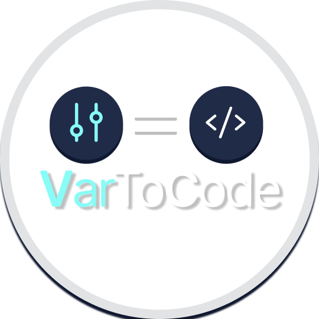
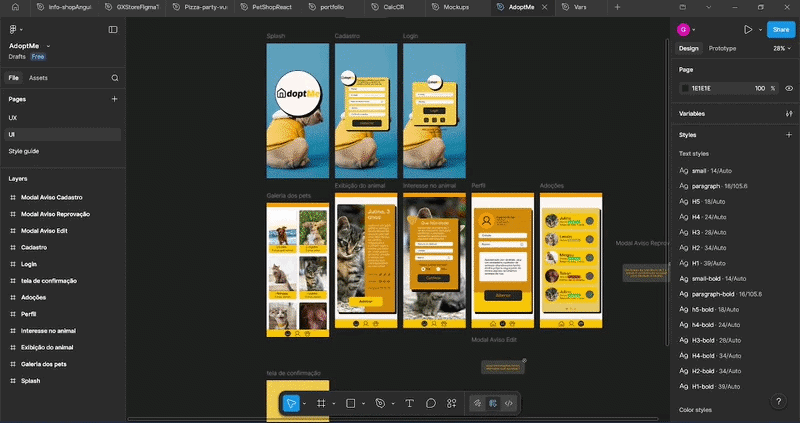

<p align="center">
  
</p>

<h1 align="center">VarToCode</h1>

<p align="center">
  Turn Figma Variables into production-ready Tailwind v4.1 tokens.

VarToCode exports Figma Variables and Styles directly to Tailwind CSS v4.1-compatible CSS and structured JSON.  
No manual copying. No external services. No data leaves your Figma file.

</p>

<p align="center">
  
</p>
---

## ✨ Features

- Export Variables to Tailwind v4.1 CSS
- Export raw JSON (variables & collections)
- Export Collections + Styles (page or full document scan)
- Supports light/dark modes
- Fully local execution (no backend, no analytics)
- Zero network requests

---

## 🚀 How It Works

1. Open the plugin inside Figma.
2. Choose one of the export options:
   - **CSS (Tailwind v4.1)**
   - **JSON (raw variables)**
   - **Collections + Styles**
3. Copy or download the generated output.
4. Import into your project.

---

## 📦 Using with Tailwind v4.1

After exporting the CSS file:

```css
@import "tailwindcss";
@import "./figma.tokens.css";
````

Your Figma variables will now be available as design tokens inside Tailwind.

---

## 🧠 Export Modes

### CSS (Tailwind v4.1)

Generates theme-ready CSS variables compatible with Tailwind's modern `@theme` system.

### JSON (Raw)

Exports:

* Variable collections
* Modes
* Values (normalized)
* Structured format

Ideal for:

* Custom pipelines
* Design system tooling
* Token transformation

### Collections + Styles

Exports:

* Variable collections
* Paint styles
* Text styles
* Effect styles
* Grid styles

Supports:

* Page scan (faster)
* Full document scan (more complete)

---

## ⚠️ Limitations

* Library styles may require import into the document before export.
* Document-wide scans may take longer in large files.
* The plugin does not resolve external references outside the current accessible file context.

---

## 🔒 Security & Privacy

VarToCode is designed to be fully local and privacy-first.

* No backend service
* No authentication
* No analytics
* No data collection
* No network requests
* No storage of user data

All processing happens inside the Figma plugin runtime.

Clipboard access is triggered only when the user clicks “Copy”.

When enabled, team library enumeration is limited to metadata (name/type) and does not download or transmit assets.

---

## 🛠 Development

### Project Structure

```
src/
  exporters/
    raw.ts
    styles.ts
    tailwind.ts
  shared/
    serialize.ts
    util.ts
  code.ts
  controller.ts
  main.ts
scripts/
  build.js
ui.html
manifest.json
```

---

### Install Dependencies

```bash
npm install
```

### Build

```bash
npm run build
```

### Watch Mode

```bash
npm run build -- --watch
```

---

## 📦 Manifest Configuration

* `documentAccess: "dynamic-page"`
* `networkAccess: none`
* No backend permissions required

---

## 🧭 Roadmap Ideas

* Token filtering
* Partial export
* CLI companion tool
* Advanced Tailwind preset generation
* Multi-file export

---

## 🤝 Contributing

Pull requests and suggestions are welcome.

---


